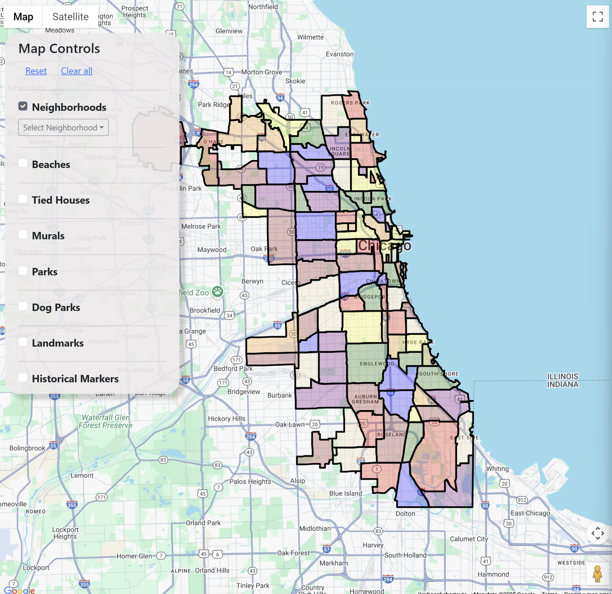
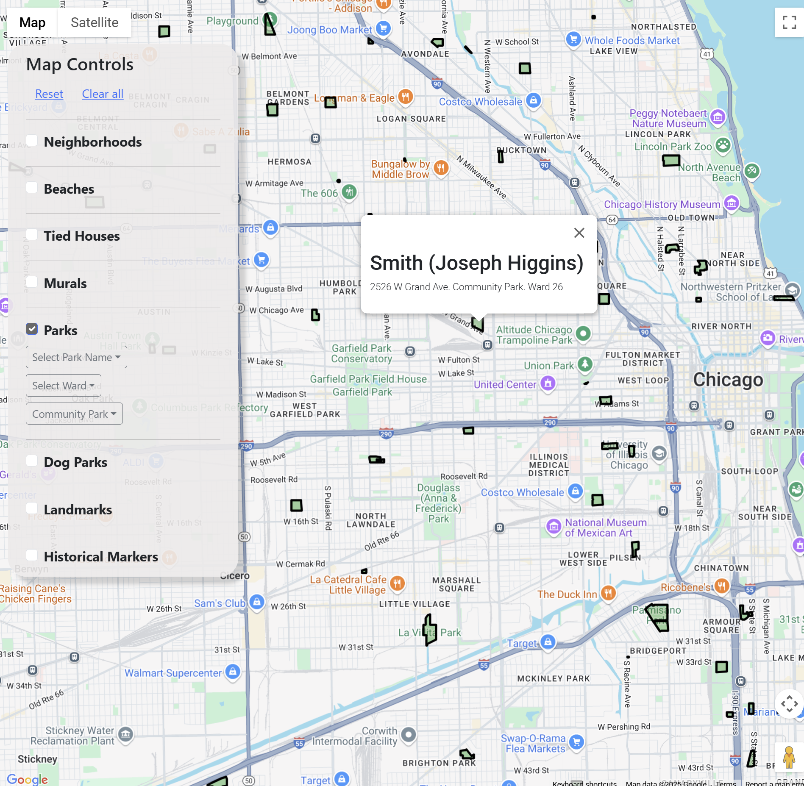
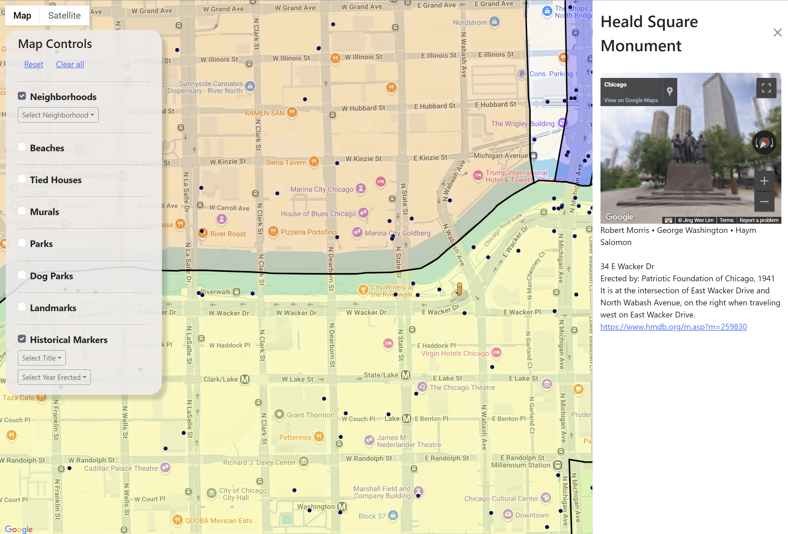

# Hidden Chicago
### A personal work-in-progress.

---
## Starting up

`npm start` and open `localhost:3000`. Simple!

A work in progress. Adding data sources as I find interesting things.

Credit: this project was bootstrapped with [Create React App](https://github.com/facebook/create-react-app).
